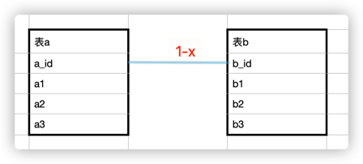
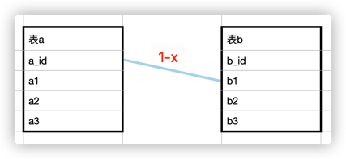
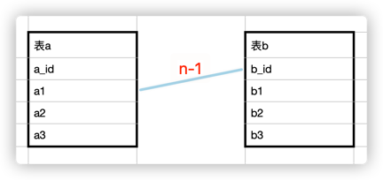
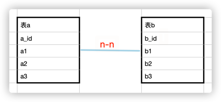

## Relation概念

`relation`就是表与表(或者是对象与对象)之间的对应关系，用表来举例

### 1-1 & 1-n

如下图，`1-1`或`1-n`的关系是从表b的某一列关联了主表a的主键



上面两张图对应的`relation`结构分别是

```json
{
  "name": "a",
  "primaryKey": "a_id",
  "children": [
    {
      "name": "b",
      "primaryKey": "b_id",
      "foreignKey": "b_id",
      "relatedKey": "a_id",
      "nested": false
    }
  ]
}
```

```json
{
  "name": "a",
  "primaryKey": "a_id",
  "children": [
    {
      "name": "b",
      "primaryKey": "b_id",
      "foreignKey": "b1",
      "relatedKey": "a_id",
      "nested": false
    }
  ]
}
```

如果是`1-n`的关系，只需要将`nested`改为`true`即可，这样就定义好了`1-1`、`1-n`的`relation`

### n-1

如下图，n-1的关系即是，从表b的主键关联了主表a的非主键，这种关系也叫做主父关系吧(自己定义的)

对应的`relation`结构如下

```json
{
  "name": "a",
  "primaryKey": "a_id",
  "children": [
    {
      "name": "b",
      "primaryKey": "b_id",
      "foreignKey": "b_id",
      "relatedKey": "a1",
      "nested": false
    }
  ]
}
```

### n-n

如下图，`n-n`关系即是，从表b的非主键关联了主表a的非主键


暂不支持这种`relation`结构

## 字段释义

- name: 名称，例如从canal同步数据时可以对应表名
- primaryKey: 主键
- relatedKey: 关联的主表键
- foreignKey: 外键
- nested: 对应es中的array和nested类型
- children: 从表

## ActionRequest实现

只组合es的`ActionRequest`，不创造

### BabyCreateIndexRequest

提供创建索引和保存`relation`的功能，内部包含`IndexReques`和`relation`,会根据`IndexReques`创建用户索引，将`relation`
保存至索引`baby_indies_relation`中

所有的索引类型均是`baby_type`

### BabyIndexRequest

提供根据`relation`配置提供更新数据的能力

分别介绍各种关系的实现

#### 1 主表

使用`UpdateRequest.upsert`实现，不存在时插入

```java
UpdateRequest updateRequest=
        new UpdateRequest()
        .index(index)
        .id(keyValue)
        .type(BabyCreateIndexRequest.BABY_INDIES_RELATION_TYPE)
        .doc(source)
        .upsert(source);
```

#### 1-1 一主一从

根据主从的`relation`结构可以找到文档id，所以使用`UpdateRequest.upsert`实现，不存在时插入(不存在时插入还需要权衡，或者做成客户端可选)

```java
Map<String, Object> map=new HashMap<>(1);
        map.put(name,source);

        UpdateRequest updateRequest=
        new UpdateRequest()
        .index(index)
        .id(relationPrimaryValue)
        .type(BabyCreateIndexRequest.BABY_INDIES_RELATION_TYPE)
        .doc(map)
        .upsert(map);
```

#### 1-n 一主多从

根据主从的`relation`结构可以找到文档id，但具体更新的是`nested`中的哪个是通过从表的`primaryKey`匹配的，使用脚本更新，实现如下

```java
//脚本
if(ctx._source.%s!=null)
        ctx._source.%s.removeIf(item->String.valueOf(item.%s)=='%s');
        if(ctx._source.%s==null)
        ctx._source.%s=[];
        ctx._source.%s.add(params.p);
```

```java
Map<String, Object> upsertMap=new HashMap<>();
        upsertMap.put(name,Collections.singletonList(source));

        UpdateRequest updateRequest=
        new UpdateRequest()
        .index(index)
        .id(relationForeignKeyValue)
        .type(BabyCreateIndexRequest.BABY_INDIES_RELATION_TYPE)
        .script(script)
        .upsert(upsertMap);
```

#### n-1 主父

由于根据主父的`relation`结构找不到文档对应id，所以使用的是`UpdateByQuery`

```java
//脚本
ctx._source.%s=params.p
```

```java
BoolQueryBuilder boolQueryBuilder=QueryBuilders.boolQuery();
        boolQueryBuilder.must(QueryBuilders.termQuery(relateKey,relationForeignKeyValue));
        UpdateByQueryRequest updateByQueryRequest=
        new UpdateByQueryRequest(new SearchRequest(index).source(new SearchSourceBuilder().query(boolQueryBuilder)));
        Map<String, Object> params=new HashMap<>();
        params.put("p",source);
        Script script=new Script(ScriptType.INLINE,DEFAULT_SCRIPT_LANG,String.format(SCRIPT_INDEX,name),params);
        updateByQueryRequest.setScript(script);
```

### BabyDeleteRequest

提供根据`relation`配置提供删除数据的能力

分别介绍各种关系的实现

#### 1 主表
直接删除
```java
DeleteRequest deleteRequest = 
        new DeleteRequest()
                .index(index)
                .type(BabyCreateIndexRequest.BABY_INDIES_RELATION_TYPE)
                .id(id);
```

#### 1-1 一主一从
即删除从表数据，使用`UpdateRequest`的脚本更新
```java
//脚本
ctx._source.removeKey('%s');
```
```java
UpdateRequest updateRequest =
        new UpdateRequest()
            .index(index)
            .type(BabyCreateIndexRequest.BABY_INDIES_RELATION_TYPE)
            .id(id)
            .script(script);
```

#### 1-n 一主多从
即删除`nested`中某一个从表数据，使用`UpdateRequest`的脚本更新
```java
//脚本
if (ctx._source.%s != null)
    ctx._source.%s.removeIf(item -> String.valueOf(item.%s)=='%s');
```
```java
UpdateRequest updateRequest =
        new UpdateRequest()
            .index(index)
            .type(BabyCreateIndexRequest.BABY_INDIES_RELATION_TYPE)
            .id(id)
            .script(script);
```

#### n-1 主父
- 如果入参中id不为空，则是更新某一个文档的数据，实现如下
```java
//脚本
ctx._source.removeKey('%s')
```
```java
Script script = new Script(ScriptType.INLINE, DEFAULT_SCRIPT_LANG, String.format(SCRIPT_DELETE, name), Collections.emptyMap());

UpdateRequest updateRequest =
        new UpdateRequest()
        .index(index)
        .type(BabyCreateIndexRequest.BABY_INDIES_RELATION_TYPE)
        .id(id)
        .script(script);
```

- 如果入参中id为空，则使用`UpdateByQueryRequest`实现
```java
//脚本
ctx._source.removeKey('%s')
```
```java
BoolQueryBuilder boolQueryBuilder = QueryBuilders.boolQuery();
            boolQueryBuilder.must(QueryBuilders.termQuery(relationForeignKey, related));Script script = new Script(ScriptType.INLINE, DEFAULT_SCRIPT_LANG, String.format(SCRIPT_DELETE, name), Collections.emptyMap());UpdateByQueryRequest updateByQueryRequest =
        new UpdateByQueryRequest(new SearchRequest(index)
        .source(new SearchSourceBuilder().query(boolQueryBuilder)))
        .setScript(script);
```
## Next

- 主父关系，父文档的保存、主文档的更新，还需要优化
- BabyDeleteRequest，删除文档，主表或从表
- n-1的情况，需要优化，例如先插入了父文档
- 代理TransportClient，实现对客户端管控
- 研究下flush
